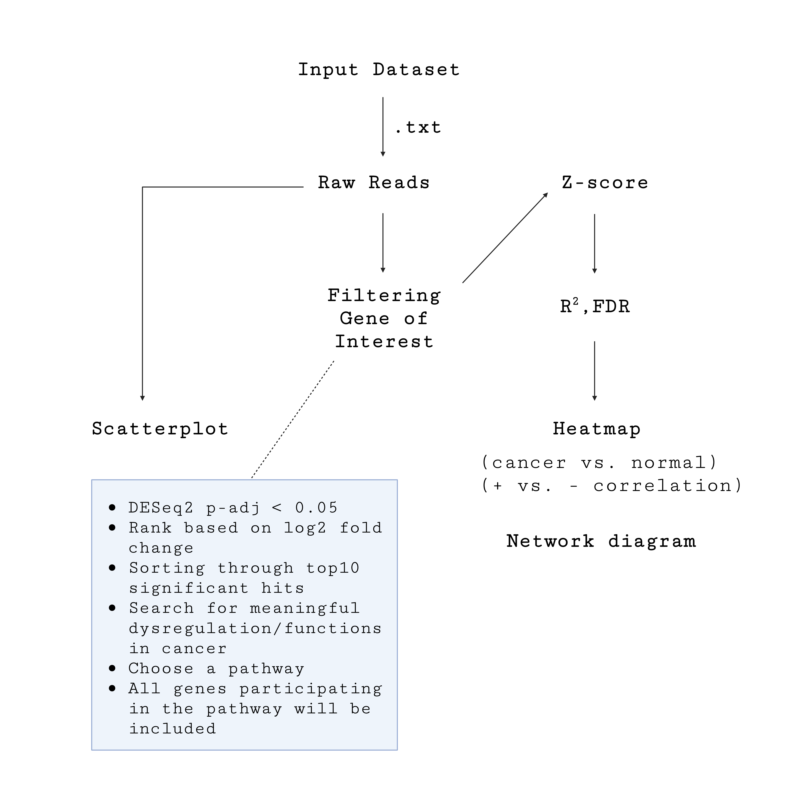
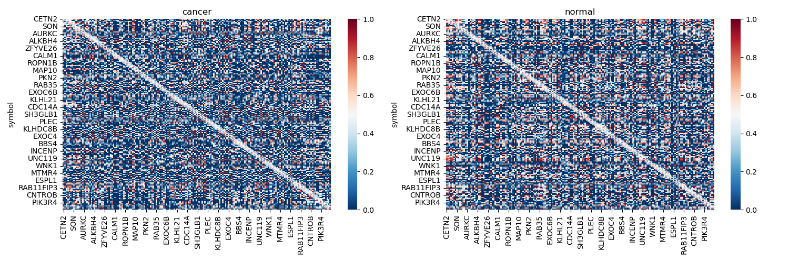
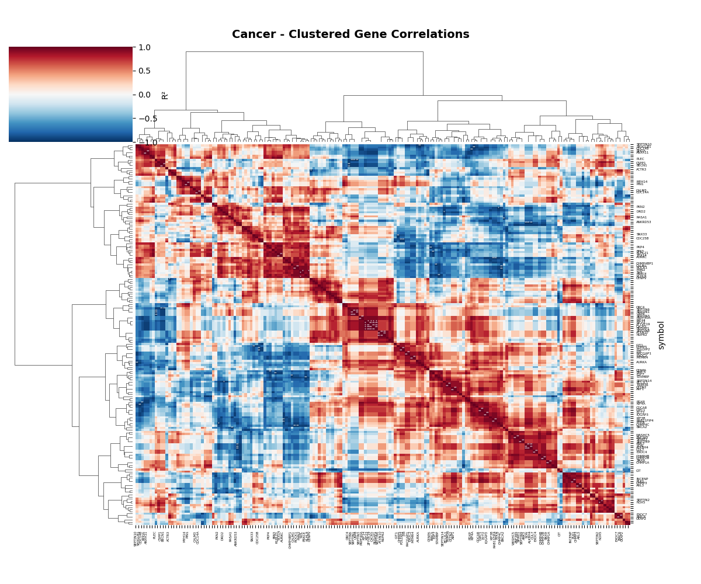
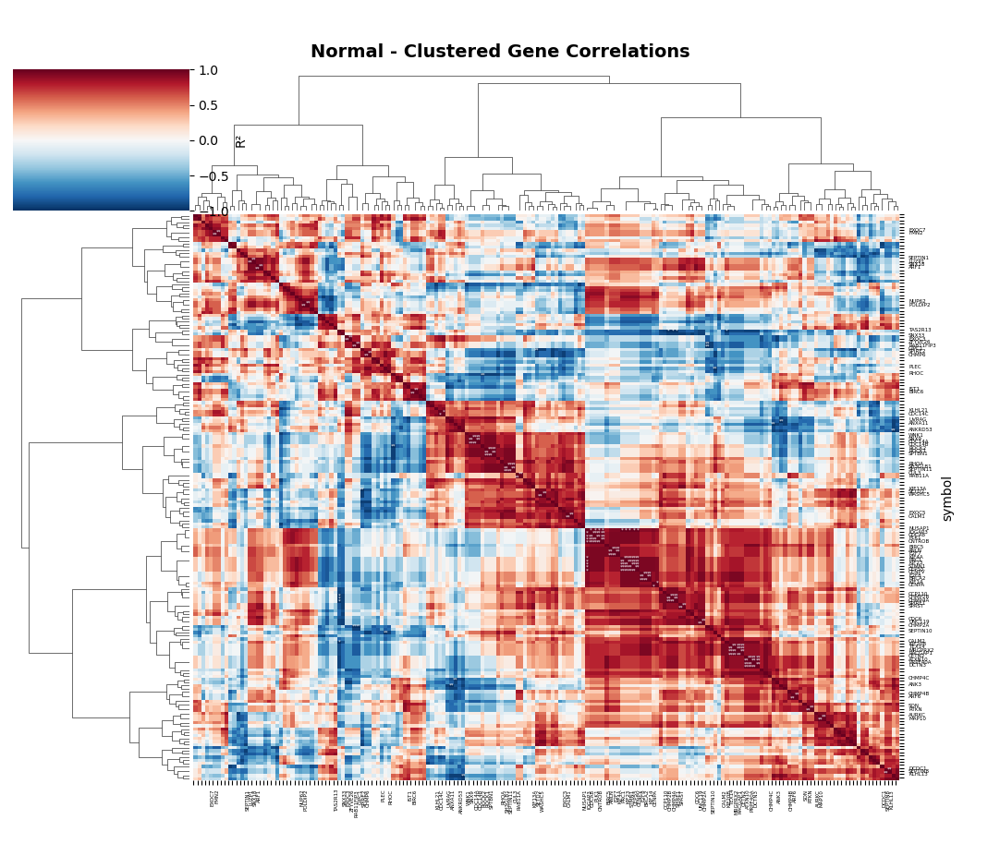
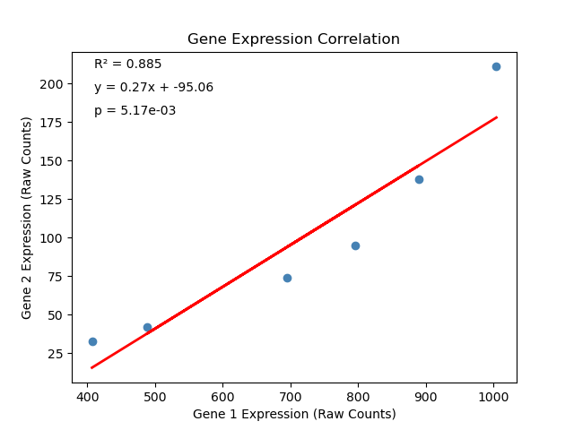

# TranscriptHomies 🧬🤝

**Members: Grace Beggs, Caroline Harrer, HeaJin Hong, Tess Kelly, Zilin Xianyu**

**TAs: Riley Kellermeyer, Bekah Kim**


## Objective: 
Build a tool that identifies and visualizes gene–gene expression correlations between two biological groups (e.g., diseased vs. normal samples). Currently, there are analysis workflows for analyzing RNA-seq data to determine differential gene expression between 2 groups.
However, what if you want to look at how differential gene expression is correlated between multiple genes from a dataset?
Our tool addresses this problem.

### General Pipeline Outline: 

1. Input RNA-seq Dataset of raw counts (genes as rows, samples as columns)
2. Determine which genes are differentially expressed between two groups
3. Perform correlation statistics
4. Represent correlation matrices as heatmaps
5. Users can view the correlation between two genes as scatter plots generated from raw reads

## Data Organization (Grace)

Pipeline workflow


## Input data search and formatting (Caroline)
Public databases (including NCBI Gene Expression Omnibus (GEO)) were screened to identify bulk RNA-seq datasets comparing control and experimental conditions, with an emphasis on cancer-related research. A breast cancer dataset comprising paired samples of adjacent normal (control) and tumor (experimental) tissues from n = 6 patients was selected for subsequent analysis (GEO accession: GSE280284, https://www.ncbi.nlm.nih.gov/geo/query/acc.cgi?acc=GSE280284 , accessed 10/25/2025).

>**Generation of a dictionary of lists for visualisation of raw counts**
For the visualization of gene expression levels across samples from raw data:
- the `pandas` package was imported
the `raw_data.txt` file was formatted into two separate (“\t”-delimited) tables — listing the gene IDs and raw gene counts for samples from the control (normal adjacent tissue, Table 1) versus the experimental group (cancer tissue, Table 2)
- a dictionary of lists was created for each table, using the gene identifier (here, "gene_id") as the key and a list of expression values for each gene across samples as the corresponding value
- the function returns a tuple of both dictionaries containing `gene_dict_control` and `gene_dict_experimental`
- to access each dictionary separately, the desired dictionary can be called from the tuple

```javascript
#!/usr/bin/env python3

import pandas as pd

gene_identifier = "gene_id"
ends_with_experimental = "CP"
ends_with_control = "C"

def make_dictionary_from_raw_data_for_visualisation (filename):

    df = pd.read_csv(filename, sep="\t", engine="python")

    #  print(df.columns.tolist())
    #  df.columns = df.columns.str.strip()

    ds_columns_control = [col for col in df.columns if col.endswith(ends_with_control)]
    df_ds = df[[gene_identifier] + ds_columns_control]
    gene_dict_control = df_ds.set_index(gene_identifier)[ds_columns_control].apply(list, axis=1).to_dict()

    ds_columns_experimental = [col for col in df.columns if col.endswith(ends_with_experimental)]
    df_ds = df[[gene_identifier] + ds_columns_experimental]
    gene_dict_experimental = df_ds.set_index(gene_identifier)[ds_columns_experimental].apply(list, axis=1).to_dict()

    return gene_dict_control, gene_dict_experimental 

# filename = "GSE280284_Processed_data_files.txt"
# dictionary_complete_tuple = make_dictionary_from_raw_data_for_visualisation(filename)
# control_dict = dictionary_complete_tuple[0] 
# experimental_dict = dictionary_complete_tuple[1]

# print(f'control_dict: {control_dict}')
# print(f'experimental: {experimental_dict}')

```


## Correlation Analysis (Zilin and Tess)

### PyDESeq2 Analysis: tests for differential expression by use of negative binomial generalized linear models

### 1. Import Libraries and Set Parameters
```javascript
import pandas as pd
from pydeseq2.dds import DeseqDataSet
from pydeseq2.ds import DeseqStats

file = "GSE280284_Processed_data_files.txt"
cond1 = "C"
cond2 = "CP"

```

### 2. Load and Filter Data
```javascript
df = pd.read_csv(file, sep="\t", index_col=0)
samples = [c for c in df.columns if c.endswith(cond1) or c.endswith(cond2)]
counts = df[samples]

### Filter low-count genes (≥10 counts in ≥3 samples)
MIN_COUNTS = 10
MIN_SAMPLES = 3
genes_pass_filter = (counts >= MIN_COUNTS).sum(axis=1) >= MIN_SAMPLES
filtered_counts = counts[genes_pass_filter]

``` 


### 3. Run DESeq2 Paired Analysis
```javascript
dds = DeseqDataSet(
    counts=filtered_counts.T,
    metadata=meta[["patient", "condition"]],
    design_factors=["patient", "condition"]
)
dds.deseq2()
```
### 4. Get Significant Results
```javascript
stat_res = DeseqStats(dds, contrast=["condition", cond1, cond2])
stat_res.summary()
sig_results = results[results["padj"] < 0.05].sort_values("padj")
```

### 5. Output Summary 
```javascript
# --- Print summary ---
print(f"\n✅ DESeq2 Analysis Complete!")
print(f"📊 Results saved to: {out_file}")
print(f"✨ Significant genes (padj < 0.05) saved to: {sig_file}")
print(f"🧬 Total genes analyzed: {len(results)}")
print(f"🔬 Significant genes found: {len(sig_results)}")
print(f"🏆 Top 20 genes saved to: {top20_file}")
print(f"📁 Filtered count matrix saved to: final_input_filtered.csv") 
```


Inputs: 
1.  Gene expression matrix (genes x samples) from bulk RNA-Seq
2.  Pathway of interest

Output:
Gene-gene correlation matrix


```javascript
# gene-gene correlation matrix
genes = expression_df.index
#print(genes)
n_genes = len(genes)

pearson_corr = pd.DataFrame(np.zeros((n_genes, n_genes)), index=genes, columns=genes)
pearson_pval = pd.DataFrame(np.zeros((n_genes, n_genes)), index=genes, columns=genes)

spearman_corr = pd.DataFrame(np.zeros((n_genes, n_genes)), index=genes, columns=genes)
spearman_pval = pd.DataFrame(np.zeros((n_genes, n_genes)), index=genes, columns=genes)

# pairwise correlations and p-values
for i, g1 in enumerate(genes):
    for j, g2 in enumerate(genes):
        if j >= i:
            r, p = pearsonr(expression_df.loc[g1], expression_df.loc[g2])
            pearson_corr.loc[g1, g2] = pearson_corr.loc[g2, g1] = r
            pearson_pval.loc[g1, g2] = pearson_pval.loc[g2, g1] = p

            r_s, p_s = spearmanr(expression_df.loc[g1], expression_df.loc[g2])
            spearman_corr.loc[g1, g2] = spearman_corr.loc[g2, g1] = r_s
            spearman_pval.loc[g1, g2] = spearman_pval.loc[g2, g1] = p_s


# FDR (Benjamini-Hochberg) 
# explain why FDR correction is needed
pearson_fdr = pd.DataFrame(
    false_discovery_control(pearson_pval.values.flatten(), method='bh').reshape(n_genes, n_genes),
    index=genes, columns=genes
)

spearman_fdr = pd.DataFrame(
    false_discovery_control(spearman_pval.values.flatten(), method='bh').reshape(n_genes, n_genes),
    index=genes, columns=genes
)

```


## Visualization and Output (HeaJin)
>**HEATMAP**
* The heat map will be a 2D graphical representation of how genes are correlated to each other (based on the R² values).
* The heat map will be generated on cancer and adjacent normal cells. 
* The heatmap script was adapted from the following sources: 
[Link1](https://www.geeksforgeeks.org/python/how-to-create-a-seaborn-correlation-heatmap-in-python/)
[Link2](https://medium.com/@szabo.bibor/how-to-create-a-seaborn-correlation-heatmap-in-python-834c0686b88e)
[Link3](https://python-graph-gallery.com/92-control-color-in-seaborn-heatmaps/)

* The heat map will be generated using Seaborn module
* To install Seaborn to an environment, type the following command in the terminal: 
`micromamba install seaborn pandas matplotlib`

* Challenges and accomplishments: the regular heat map `sns.heatmap()` was very disorganized and we were not able to draw clear information out of it (see below). When we used the `sns.clustermap()` method, we were able to cluster genes with high or low +/- correlation. Also, since we are looking at > 100 genes, the names were all squeezed together. We decided to just print out genes that had the significant results (low p-values).

```javascript
#!/usr/bin/env python3

import matplotlib.pyplot as plt
import pandas as pd
import seaborn as sns 

def add_stars(fdr):
    """Add significance stars, excluding diagonal"""
    annotations = []
    for i in range(len(fdr)):
        row = []
        for j in range(len(fdr.columns)):
            if i == j:
                text = ''  # No annotation for diagonal
            else:
                p_val = fdr.iloc[i, j]
                if p_val < 0.01:
                    text = '**'
                elif p_val < 0.05:
                    text = '*'
                else:
                    text = ''
            row.append(text)
        annotations.append(row)
    return annotations

def find_genes_with_stars(fdr):
    """Find genes that have significant correlations"""
    genes_with_stars = set()
    
    for i in range(len(fdr)):
        gene = fdr.index[i]
        for j in range(len(fdr.columns)):
            if i != j:  # Exclude diagonal
                p_val = fdr.iloc[i, j]
                if p_val < 0.05:  # Has * or **
                    genes_with_stars.add(gene)
                    break
    return genes_with_stars

# Load datasets
r2_cancer = pd.read_csv("lin/spearman_gene_correlation_r2_DS.csv", index_col=0)
r2_norm = pd.read_csv("lin/spearman_gene_correlation_r2_NM.csv", index_col=0)
fdr_cancer = pd.read_csv("lin/spearman_gene_correlation_fdr_DS.csv", index_col=0)
fdr_norm = pd.read_csv("lin/spearman_gene_correlation_fdr_NM.csv", index_col=0)

# Find genes with significant correlations
cancer_genes_with_stars = find_genes_with_stars(fdr_cancer)
normal_genes_with_stars = find_genes_with_stars(fdr_norm)

# Create annotations
ann_c = add_stars(fdr_cancer)
ann_n = add_stars(fdr_norm)

# Cancer clustered heatmap
cancer_cluster = sns.clustermap(r2_cancer, 
                               vmin=-1, vmax=1,
                               annot=ann_c, 
                               fmt='', 
                               cmap='RdBu_r',
                               figsize=(12, 10),
                               method='ward',
                               metric='euclidean',
                               cbar_pos=(0.01, 0.3, 0.01, 0.05),  # [left, bottom, width, height]
                               cbar_kws={'label': 'R²'},
                               annot_kws={'size': 4},
                               xticklabels=True,
                               yticklabels=True)

# Normal clustered heatmap  
normal_cluster = sns.clustermap(r2_norm, 
                               vmin=-1, vmax=1,
                               annot=ann_n, 
                               fmt='', 
                               cmap='RdBu_r',
                               figsize=(12, 10),
                               method='ward',
                               metric='euclidean',
                               cbar_pos=(0.01, 0.3, 0.01, 0.05),  # [left, bottom, width, height]
                               cbar_kws={'label': 'R²'},
                               annot_kws={'size': 4},
                               xticklabels=True,
                               yticklabels=True)

plt.show()

```






>**SCATTERPLOT**
* This will generate a close-up view of how the raw read counts (expression level) of the two genes are correlated.
* The scatterplot will be fitted using the linear regression model

* To install scipy, type the following command in the terminal: 
`micromamba install scipy numpy`

* challenges and accomplishments: In the dictionary, some geneID had a pipe symbol ('|') in it, so I was not able to call out that gene ID. Caroline helped in converting the dictionary into gene names instead of the gene ID so I was able to call out the list properly. Also, TYPOS!!! When we crosschecked our scripts, we were able to find out the problem quickly! 

```javascript
#!/usr/bin/env python
#pip install scipy ## this is a unix command
from pandas import DataFrame
import numpy as np
import matplotlib.pyplot as plt
import scipy.stats
import sys
from dictionary_of_lists_for_scatterplot_GENE_NAMES_final import make_dictionary_from_raw_data_for_visualisation

#Raw data will be prepared in a dictionary format. 
raw_orig = make_dictionary_from_raw_data_for_visualisation('GSE280284_Processed_data_files.txt')
ctrl_dict = raw_orig[0] #this is the parsed dictionary from the raw reads
exp_dict = raw_orig[1]
# print(ctrl_dict)
# print(exp_dict)

geo1 = exp_dict['KIF23'] #geneID of interest
geo2 = exp_dict['CXCR5'] #geneID of interest
# print(geo1)
# print(geo2)
data = {'X': geo1, 'Y': geo2}

df = DataFrame(data, columns = ['X', 'Y'])
m, b, r_value, p_value, std_err = scipy.stats.linregress(df['X'], df['Y'])

fig, ax = plt.subplots() #this creates a blank figure and axis for plotting 
                         #(fig= entire plot window) (ax = the actual plot area,labels,styling)
#plot the data points
ax.scatter(df['X'], df['Y'], color = 'steelblue', label = 'title of the scatterplot')

#plot the regression line
ax.plot(df['X'], m*df['X'] + b, color = 'red', linewidth = 2, label = 'regression')

#add statistics 
ax.annotate(f'R² = {r_value**2:.3f}', xy=(0.05, 0.95), xycoords='axes fraction')
ax.annotate(f'y = {m:.2f}x + {b:.2f}', xy=(0.05, 0.88), xycoords='axes fraction')
ax.annotate(f'p = {p_value:.2e}', xy=(0.05, 0.81), xycoords='axes fraction')

#labels and styling
ax.set_xlabel('Gene 1 Expression (Raw Counts)')
ax.set_ylabel('Gene 2 Expression (Raw Counts)')
ax.set_title('Gene Expression Correlation')

plt.show()

print(f"R² = {r_value**2:.4f}")
print(f"P-value = {p_value:.2e}")

```


>**MASTER SCRIPT USING JUPYTER NOTEBOOK**

**Acknowledgement**


[def]: /Users/pfb/transcripthomies/TranscriptHomies/TH_flowchart.png